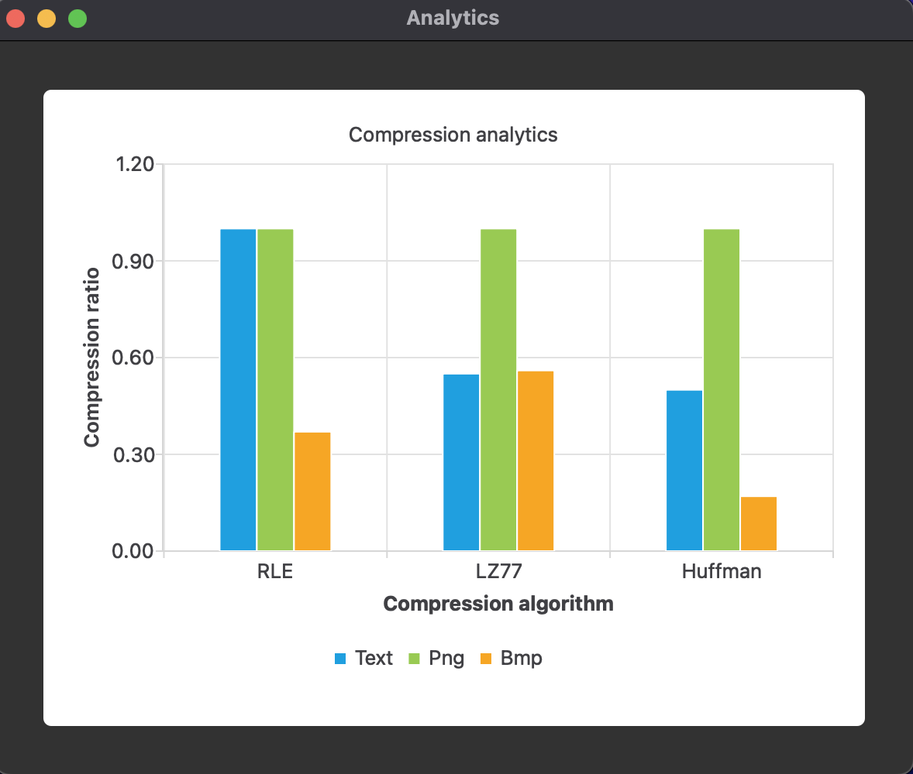

# PackedApp
Course work of 2 course software for packing/unpacking files.
## Features
- Packing/unpacking files using:
  - RLE
  - LZ77
  - Huffman 
- Graphics analytics of algorithms
- File manager for choosing file

## UI

 
 

